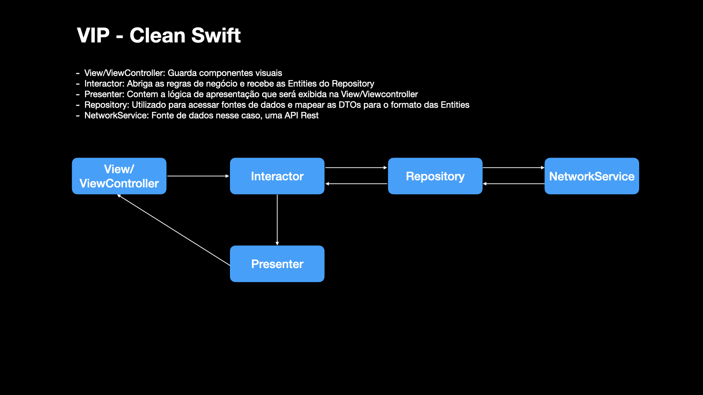

# 🎯 DESAFIO iOS MOBILE PLATFORM OLX

Uma das principais responsabilidades do time de *mobile platform* da OLX Brasil é evoluir constantemente a arquitetura dos nossos apps.

Para isto, as pessoas engenheiras da nossa squad precisam dominar as melhores práticas de arquitetura de software (ex: modularização e desacoplamento), assim como garantir a qualidade e segurança.

Desafio:

Faça um fork desse repo e refatore o aplicativo para uma nova arquitetura que garanta:

* Escalabilidade, ou seja, permita que novas features sejam adicionadas sem necessidade de alterar o código existente
* Reuso, ou seja, permitir que partes do app possam ser reaproveitadas em outros apps  
* Testabilidade - Aqui gostaríamos de analisar sua implementação de testes unitários e de UI 

Você poderá ganhar pontos extras se (totalmente opcional):

* Implementar automação de CI/CD
* Habilitar ferramenta de análise estática de seu código  

Dica:

* Como somos um time de plataforma, estamos mais interessados em analisar seus skills em arquitetura, portanto você não precisa evoluir a UI (usabilidade / telas / interface)
* Para que possamos analisar o seu processo de desenvolvimento, não desenvolva tudo em uma única branch ou em um único commit

Boa sorte :)

# ✅ Concluído
* [x] Escalabilidade
    - [x] Definicão de uma arquitetura que favorece testes
    - [x] Definição de um fluxo de trabalho e uso das branches
    - [x] Uso do [tuist](https://tuist.io/) que elimina conflitos nos arquivos de projeto `(.xcodeproj, .xcworkspace, .pbxproj)` pois não se faz necessário versiona-los, gera assets e localized strings fortemente tipadas automaticamente, todo o processo de configuração do projeto é feito através do arquivo de [Manifest](https://github.com/rafaelhziliao/desafio-mobile-platform/blob/master/Project.swift) que é escrito em `Swift`, para acessar configuração do projeto, basta executar o comando `./.tuist-bin/tuist edit` na raíz do projeto. Feitas as alterações basta salvar e rodar o script [up](https://github.com/rafaelhziliao/desafio-mobile-platform/blob/master/Scripts/up.sh) `./Scripts/up.sh`
    - [x] Uso da ferramenta [fastlane](https://fastlane.tools/) que pode ser usada para: [code sign](https://docs.fastlane.tools/actions/match/), [buildar e rodar testes](http://docs.fastlane.tools/actions/scan/#scan), [fazer deploy para o testflight](http://docs.fastlane.tools/actions/gym/#gym), tudo isso e muito mais, localmente ou em ambientes de CI.
* [x] Reuso
    - [x] Criação de uma camada de [Network](https://github.com/rafaelhziliao/desafio-mobile-platform/blob/master/Modules/NetworkLayer) que possui a capacidade de adicionar novos providers e ainda conta com um default que seria baseado no `URLSession`
* [x] Testes
    - [x] Testes unitários nas camadas de Repository, Interactor e Presenter
* [x] Implementar automação de CI/CD
* [x] Habilitar ferramenta de análise estática de seu código

# [] Ficou faltando 🤷‍♂️
* [] Testes de UI
* [] Criar um framework de Design System
* [] Criar um framework pra abrigar coisas mais comuns um CoreKit ou algo do tipo

# Resumo:
* [Requisitos](#Requisitos)
* [Dependências](#dependências)
* [Setup](#setup-inicial)
* [Workflow](#workflow)
* [Branches](#branches)
* [Arquitetura](#arquitetura)
* [CI](#continous-integration)

## Requisitos
* Xcode 12.4
* swift 5.0
* ruby 2.6.6
* iOS 14.4 (iPhone)

## Dependências
* [tuist](https://tuist.io/) - Manutenção de projetos xcode de grande escala
* [bundler](https://bundler.io/) - Versionador Gems do ruby como `cocoapods e fastlane`
* [homebrew](https://brew.sh/index_pt-br) - Gerenciador de pacotes para macOS
* [rbenv](https://github.com/rbenv/rbenv) - Gerenciador de ambientes ruby

`OBS:` Como esse projeto usa o Bundler não esquecer de usar o `bundle exec` antes de usar os comandos que envolvem gems, por exemplo: `bundle exec pod install, bundle exec fastlane`

## Versão das Dependências
> As versões podem ser encontradas nos arquivos:
* [tuist](https://github.com/rafaelhziliao/desafio-mobile-platform/blob/master/.tuist-version)
* [Gemfile](https://github.com/rafaelhziliao/desafio-mobile-platform/blob/master/Gemfile)
* [Podfile](https://github.com/rafaelhziliao/desafio-mobile-platform/blob/master/Podfile)
* [Ruby](https://github.com/rafaelhziliao/desafio-mobile-platform/blob/master/.ruby-version)

> Não se preocupe com essas instalações o [script](https://github.com/rafaelhziliao/desafio-mobile-platform/blob/master/Scripts/setup.sh) de *Setup Inicial* cuidará disso! 😉

## Setup inicial
1. Clone esse repositório
2. Na raíz projeto rode o script `./Scripts/setup.sh`
3. Rode o projeto 🚀

## Para abrir/rodar após o setup inicial
1. Na raíz do projeto rode o script `./Scripts/up.sh`

## Workflow
Neste projeto, temos a regra de que a branch master deve estar sempre pronto para liberação, o que significa que todo código incorporado a ele deve ser previamente testado e aprovado pelo controle de qualidade.

## Branches

#### Nomeando
Você só pode criar branches seguindo estes padrões:

- feature/[FEATURE_NAME]
- fix/[FEATURE_NAME]
- test/[FEATURE_NAME]
- task/[DESCRIPTION]

#### Organização

Exemplo da hierarquia de branches:

`master` -> `feature/` -> `task/`
or
`master` -> `feature/` -> `test/`
or
`master` -> `feature/` -> `fix/`
or
`master` -> `fix/`
or
`master` -> `test/`

## Arquitetura

  

[**VIP (Clean Swift)**](https://clean-swift.com/clean-swift-ios-architecture/vip-cycle/)

[**Repository e DTOs**](https://betterprogramming.pub/why-model-objects-shouldnt-implement-swift-s-decodable-or-encodable-protocols-1249cb44d4b3)

[**DomainModel**](https://martinfowler.com/eaaCatalog/domainModel.html)

## Continous Integration
- Toda vez que é aberto um PR para a branch `master` o github actions irá rodar o `lint` buildar e rodar os testes